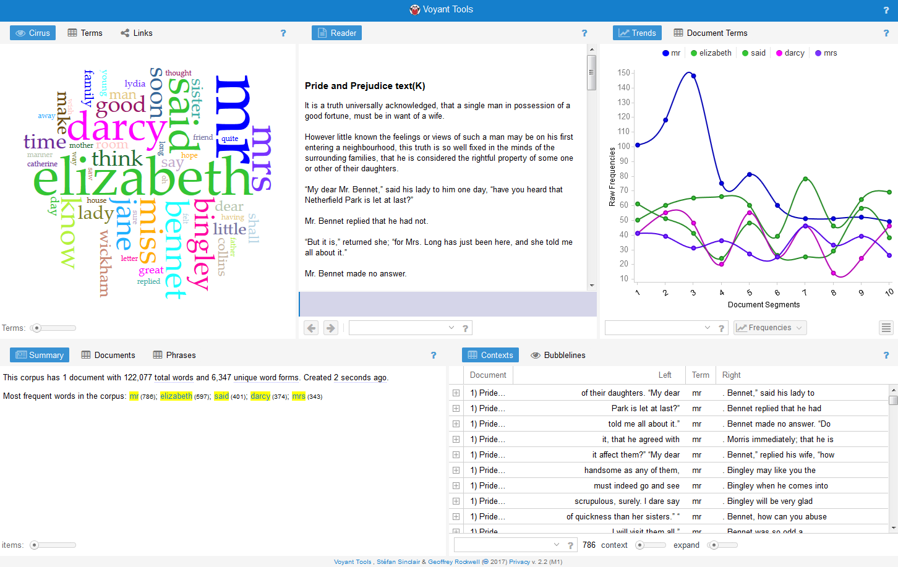

# [January 27, 2020]

## Things I Learned Today
- that anyone can code
- the qualities of plain text and how it is converted through a word processor

### Markdown

Wow! This is my *very first* markdown file!

I'm impressed with myself for **these reasons**:
- coding has always been something that confuses me but now I am learning about it
- I am taking a class that is outside of my comfort zone

- I've learned something new
- I'm on my to becoming a [digital humanist](https://en.wikipedia.org/wiki/Digital_humanities)

